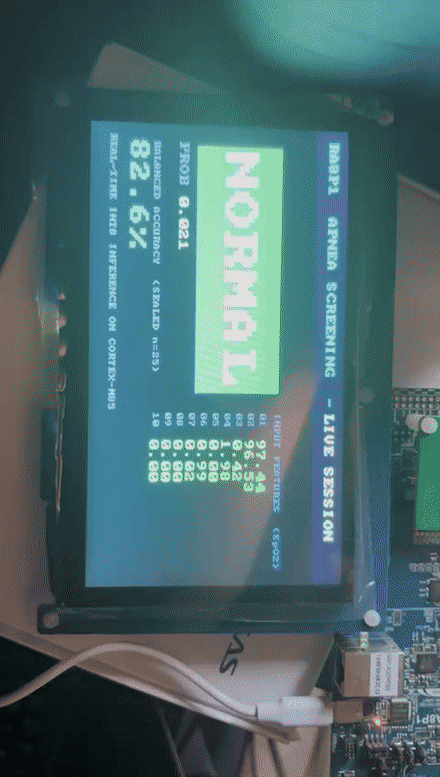

# On-device sleep apnea screening — adaptive & privacy-preserving

A sleep apnea / hypopnea screener that runs **entirely on a microcontroller**
(Renesas EK-RA8P1, Arm Cortex-M85), **adapts to each patient on the device**
without any labelled data, and **improves across devices through federation** —
sharing only calibration statistics, never patient data.



*Live dashboard running on the real board: the model streams a night of data and
shows the apnea/normal verdict, the input features, and the measured accuracy in
real time.*

> **Research prototype, not a clinical device.** No medical claims. Every number
> below is measured and reported honestly, including what is not yet proven.

---

## Highlights

- **On-device inference:** a 10→32→16→1 INT8 MLP (897 parameters, SpO2 features).
  **77 µs** per calibrated session, **~2 KB** RAM, **6.7 µs** per inference —
  and **bit-exact** against the host reference.
- **Label-free self-calibration:** **+0.035 balanced accuracy** on a *sealed*
  cohort of unseen patients (0.791 → 0.826, 95% CI [+0.006, +0.065]) — with **no
  labels** at inference. The label-free path matches the labelled one.
- **Privacy-preserving federation:** pooling calibration across 1→70 devices adds
  **+0.048 balanced accuracy** (CI [+0.036, +0.060]), saturating at ~20–40 devices.
  Only calibration statistics leave a device — never raw patient signals.
- **A working edge dashboard** on the board's LCD (see the demo above).

Full numbers and methodology: [`docs/RESULTS.md`](docs/RESULTS.md).

---

## What the demo shows

The board runs the shipped INT8 model in real time. Each window (60 s of a night)
produces an **APNEA** or **NORMAL** verdict, shown large, alongside the model
probability, the live input feature vector, and the measured balanced accuracy.

**An honest note on the sensor.** We were not able to attach live SpO2 sensors to a
patient — we are building this from a remote area in India, where the clinical-grade
sensor hardware and setup would have been prohibitively expensive for us. So instead
of live capture, we stream **real recorded overnight recordings** (from the CinC 2018
clinical dataset) into the board one window at a time. The board runs *exactly* the
same inference it would on a live signal — the sensor front-end is the one piece we
have not wired yet, and it is on the roadmap.

---

## Results (sealed cohort, n = 25 unseen patients)

| method | balanced accuracy | Δ vs shipped | 95% CI |
|---|---|---|---|
| fixed threshold (shipped) | 0.7910 | — | — |
| label-free recalibration | **0.8256** | **+0.0347** | [+0.0057, +0.0651] |
| labelled reference | 0.8269 | +0.0359 | [+0.0080, +0.0656] |

Reported as **balanced accuracy** (the rare-class-safe metric), not raw accuracy.
Ranking (AUROC) is unchanged — the gain is at the operating point. See
[`docs/RESULTS.md`](docs/RESULTS.md) for federation curves, metrics, and limitations.

---

## How it works

```
 SpO2 signal ─▶ 60 s window features ─▶ INT8 MLP (Cortex-M85) ─▶ APNEA / NORMAL
                                              │
                 ┌────────────────────────────┴───────────────────────────┐
                 ▼                                                          ▼
   per-session recalibration (on device, label-free)     fleet federation (calibration stats only)
```

- **On-device inference** — the INT8 model runs on the M85 core, pure CPU.
- **Label-free recalibration** — each session re-centres its own decision threshold
  from its unlabelled data. This is the +0.035 gain.
- **Federation** — devices pool calibration statistics into a shared reference; a new
  device benefits from the fleet without any patient data leaving any device.

---

## Repository layout

| path | what |
|---|---|
| `firmware/apnea_dashboard/` | on-board LCD dashboard firmware + build/flash + host driver |
| `ml/` | training / feature / federation pipeline (Python) |
| `docs/RESULTS.md` | authoritative results and methodology |
| `docs/ENGINEERING_LOG.md` | chronological engineering record |
| `docs/BOARD_NOTES.md` | board setup, commands, reproduction notes |
| `apnea_project.pptx` | project presentation |
| `apnea_speaker_script.md` | per-slide speaker script |
| `assets/` | demo GIF / MP4 |
| `src/`, `ra/`, `ra_gen/`, `ra_cfg/`, `script/` | RA8P1 / FSP firmware project |

---

## Run it

### Board dashboard
See [`firmware/apnea_dashboard/README.md`](firmware/apnea_dashboard/README.md).
Build with the Arm GNU toolchain, flash with J-Link, and the board animates on its
own. Drive a real night over serial:

```bash
python3 firmware/apnea_dashboard/live_demo.py --board --loop --subject tr03-0413
```

### ML pipeline
```bash
pip install tensorflow scikit-learn numpy scipy   # see ml/ for details
# training / feature extraction / federation live under ml/
```

---

## Presentation
- **Deck:** [`apnea_project.pptx`](apnea_project.pptx)
- **Speaker script (per slide):** [`apnea_speaker_script.md`](apnea_speaker_script.md)

---

## Scope & what is not yet claimed
- Validated on **25 sealed patients** (target: 100–200). The gain's CI lower bound
  (+0.0057) does not yet clear our pre-registered +0.02 minimum effect — promising,
  needs a wider cohort.
- **AUROC unchanged** — the gain is at the decision threshold, not ranking.
- **AHI** is reported as a window-count proxy; a proper event-scored index is future work.
- **No energy figure** — no current probe on the board; we report cycles and RAM only.
- The **Ethos-U55 NPU** is present in silicon but **unused** — inference runs on the CPU.
- The **sensor front-end** is not wired; the board runs recorded data (see above).

These are the roadmap, not failures — each builds on something already demonstrated.
